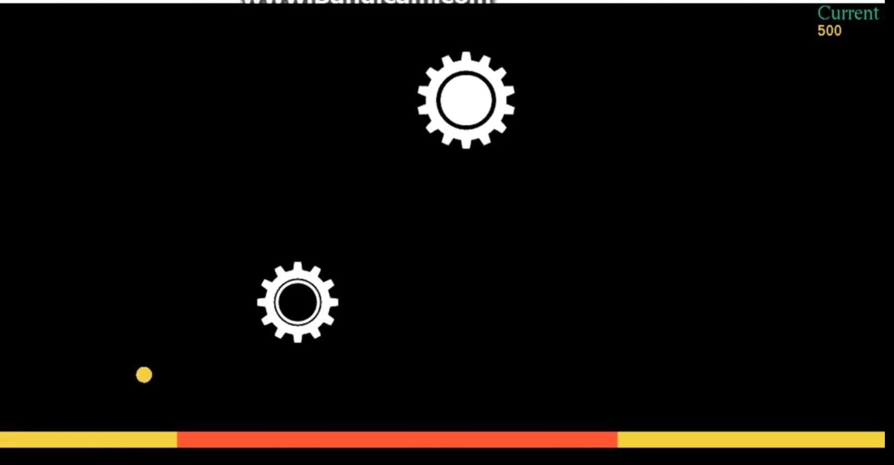
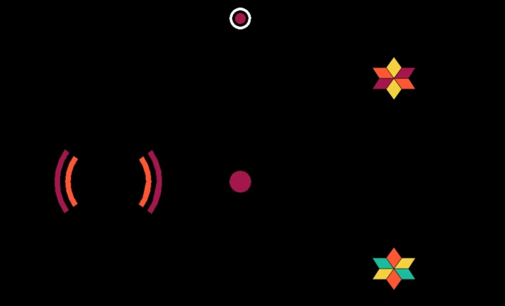

# ColorSwitchMAT
### 1st year 2nd semester's Software Development project (Visual Studio-iGhraphics) 
A game in which players need to pass a ball that changes color through different obstacles by matching colors with it. If the player fails to match color then the game is over for that person otherwise, he gets points. 
Platform: Visual Studio, Language: C

Some of the images of the game are shown below.  

Instruction to play the game is given <a href="https://youtu.be/_D1VPexFtf4">Here</a>. 
A short Demonstration of the game is provided <a href="https://youtu.be/i5eC3jORucQ">Here</a>.
